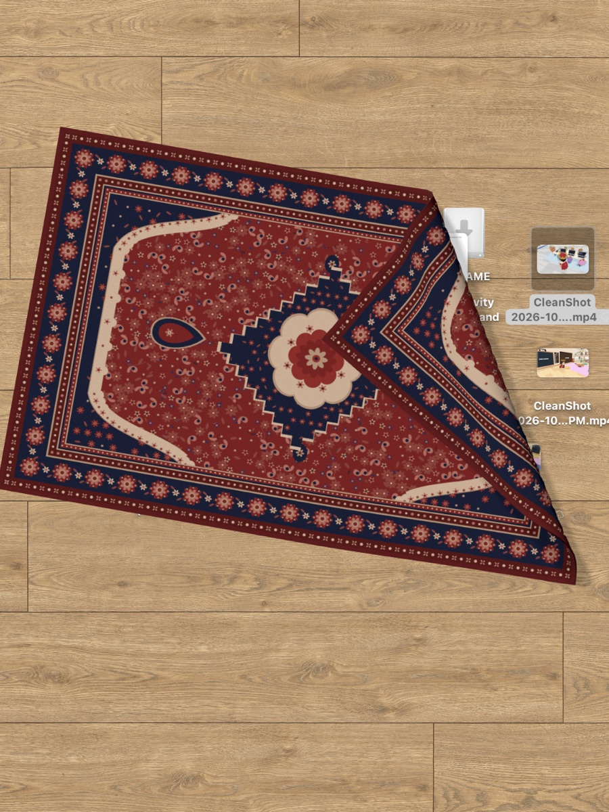

<div align="center">

# 桌面地毯

**一块铺在 Mac 桌面上的地毯，桌面乱了就拿它盖上。**



<br>
<br>

[](https://github.com/JosssphZhou/desktop-rug/releases/latest)


[English](README.md) · 中文

</div>

---

桌面地毯在你的桌面上铺一块布做的地毯。它在桌面图标上面、所有窗口下面，乱糟糟的桌面往它下面一藏就看不见了。文件不会被移动，地毯只是盖住它们。

灵感来自 [Terkel 的视频](https://x.com/terkelg/status/2107540718461886464)。

## 能做什么

| | |
|---|---|
| **盖住** | 把地毯拖到图标堆上，图标就藏起来了。 |
| **掀开** | 抓住边或角往上拖，能看到下面压着什么。 |
| **对折** | 把一个角拉过去，地毯就整片折起来。 |
| **缩放** | 按住 <kbd>⌥ Option</kbd> 拖一个角，可以缩放和旋转，最大能铺满整块屏幕。 |
| **换花样** | 在菜单栏里有五种花样可选。 |

地毯以外的地方，点击直接落到桌面上。

## 安装

1. 在 [Releases](https://github.com/JosssphZhou/desktop-rug/releases/latest) 下载 **DesktopRug-0.1.0.zip**。
2. 解压，把 **桌面地毯.app** 拖进「应用程序」。
3. 打开。它只在菜单栏出现，不在程序坞里。

> [!NOTE]
> 如果系统提示无法验证这个应用，打开「系统设置」里的「隐私与安全性」，点「仍要打开」；或者在终端运行：
> ```sh
> xattr -dr com.apple.quarantine /Applications/桌面地毯.app
> ```

## 可选：在图标上鼓起来

菜单里的「读取桌面图标位置，让地毯鼓起来」会让地毯在有图标的地方鼓起一块。系统会弹窗请你允许「自动化」权限。应用只读取图标的位置，不移动、不打开任何文件。

## 从源码构建

```sh
npm install
scripts/make-app.sh
open build/桌面地毯.app
```

## 许可证

[MIT](LICENSE)。使用了 [three.js](https://threejs.org)（MIT）和 [Paper Shaders](https://github.com/paper-design/shaders)（Apache-2.0）。
